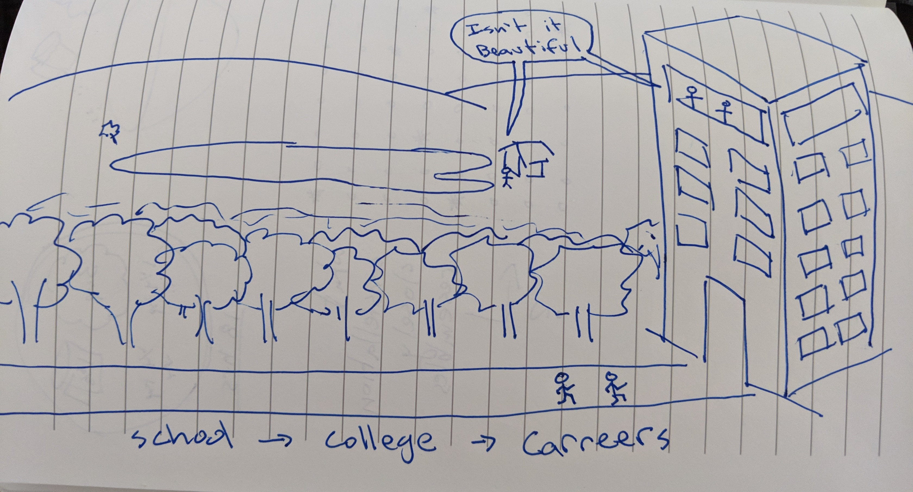

# My Awakening
The LDS (Mormon) faith of my [Formation](./myFormation.md) holds it important for all males that adhere to it's commandments to spend 2 years preaching the gospel of Jesus Christ with the aims of brining people to baptism. Females are also given the opportunity, but at the time of my youth it was strong in the culture that males are expected to go.

On that mission a common tool for helping people along their spiritual path is to show where you were on your own spiritual path through "bearing your testimony". This typically goes something like "I know Jesus Christ is my Savior, I know Joseph Smith to be his prophet that he chose in the latter days to restore his living church here on the earth. We can know this by reading the Book of Mormon which was a fruit of Joseph Smith. I know that the Book of Mormon is true. I know that the LDS faith is the true church"

A lot of emphasis is put on "knowing" and "truth". This impacted me in a very deep -- and at time -- painful way. Being that I didn't know this truth. I did the steps that they asked me to do, I read the scriptures, prayed, fasted (once for 2 days off and on) and the big takeaway that I had was in reading scriptures such as Alma 5.46 and Mosiah 27.22 was that I would have a dream that would teach me the truth. What proceeded was a normalish dream, nothing about the LDS church or Christ really. I don't have my dream journal with me anymore, if I ever find it I will hopefully revisit and update this document. But what I remember was being somewhere, camping near a lake. Being impressed with the beauty of the ripples of water as I threw stones into it. I was with my companion Elder Clark and I think we were talking about some software platform or product.

I started to regularly write my dreams down. Some of which came back in very interesting ways, like the Australian dream with my girlfriend, the chalkboard message CETTERUE before I knew any french, and the interesting date of a silver dollar that when later searched online is a year often associated with counterfeit coins and the common appearance of a woman with red hair. I found significance in these items over the years as I had experiences or knowledge bring them back full circle to me.

From that point on I started writing my dreams and I think this really awakened my inner sense of Mysticism. This heavy handed teaching of a church that you must KNOW THE TRUTH -- then seeking the truth -- and what's weird is that the truth I found was not the truth that they were telling me I'd find. Which lead to, as I put in my journal, some of the darkest times of my life. Feeling that lifeboat had been taken from me, and now I was drowning. Always reaching out for something to grab onto, but it evaporating before me as I tried to grasp it. Hearing others proclaim to "know" yet I unable to achieve. I was losing. I was lost. I had to learn to let go and pull out.

Of course this realization came and went. It wasn't an "all at once" aha moment, I mean it was and it wasn't. Like I had that aha moment, makes sense, but then the old patterns creep back in. And it cultivated really once I got off my mission and was attending BYU. I was trying so hard to compete, was doing freelance video production, had started a company called (kno) Name and going to school full time and the weight of competing on all these levels drove me to break down into tears at night while watching youtube videos and go into states of apathy. It was less of depression, and more a feeling of complete emptyness and loss of meaning of life.

What finally kicked it into focus is when I visited a school counselor. After a few sessions we had this discussion about how I felt like I was a dog at a track. Having a carrot dangled in front of my face, chasing as fast as I could and regardless of how fast I ran I could not ever achieve the goal. As a human watching the race you know that physically it is impossible for the dog to ever be faster than the machine, so they are set at an impossible task, like the man told to move a mountain or large boulder. Really the dogs that "win" are those that are not even at the race at all. They are in a meadow or park. Sometimes the best way to win is to not play at all. That really stuck with me. Pull out, let go and release.

Not that a playing dog isn't running. Competition isn't negative, but just in the right context it takes on a different life. So the goal was to not walk the path laid out infront of me, but to instead find my own path and build my own life. I would often draw this picture when tryint to explain it:

I decided then I wanted to do very "human" things. Wanted to do things that make humans feel emotions, not be a cog in a machine designed primarily for profit. I however came to a realization that most people don't choose that path easily or often in my circles because it's significantly harder. Profit machines tend to reward and value people that contribute profit and efforts towards making more material money based profit.

It's all a cycle, so I started understanding that it's a long game, and that you don't have to refuse to play one in order to play the other. Both can exist at the same time, not always in the same moment, but you can develop parrallel paths. Consciousness does not exist in the same realm as the physical metaphors I use to describe them. I will stop here and move onto the next stage... which I have trouble breaking into a clean time period, which probably means I am still in it. My Homecoming.